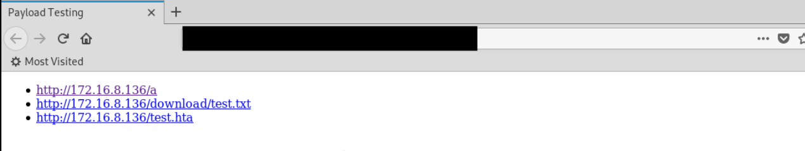

## Synopsis:

Aggressor Script automates the generation of a HTML document containing a link to all payloads for easy testing. Automation is performed by retrieving a listing of all payloads under the Sites tab. After retrieving the payloads, each page is linked within an unordered list. 

## Example:

1. Payloads currently listed under Attacks -> Manage 

2. Upload script to cobalt strike and navigate to Attacks -> HTML Generation

3. Enable or Disable Port numbers in output

4. Save file and view results

